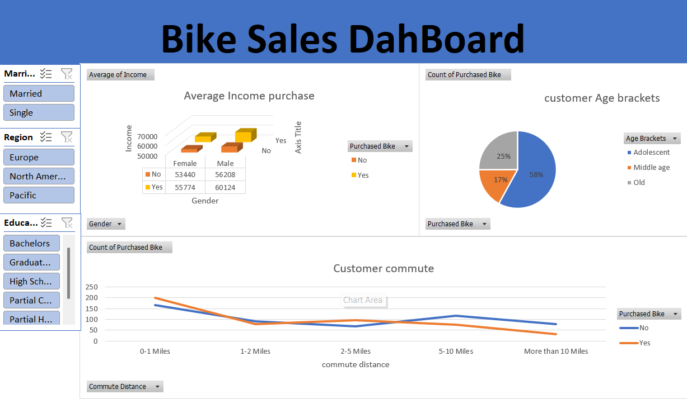
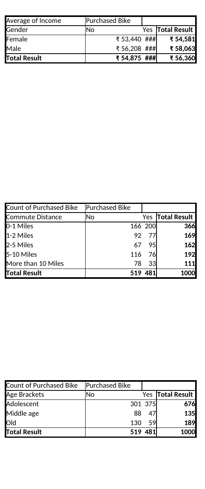
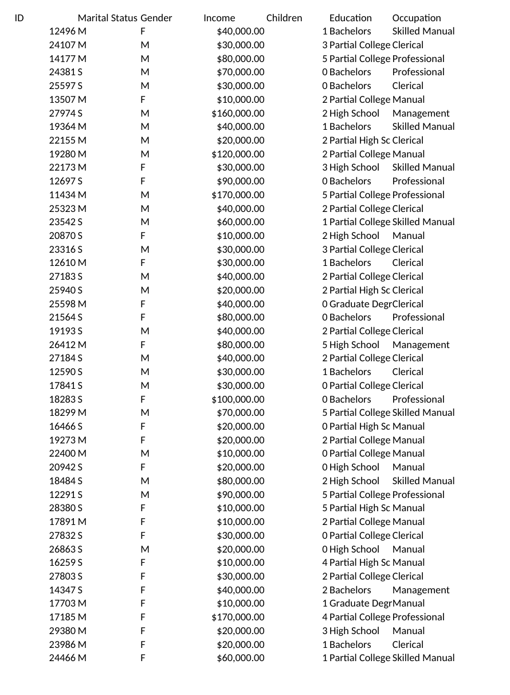

# Bike Sales Data Analysis Using Excel

## Project Overview

This project analyzes bike purchase behavior using Microsoft Excel. The workbook includes raw customer data, a cleaned working sheet, pivot-table analysis, and a dashboard designed to explore customer characteristics associated with bike purchases.

The analysis uses **1,000 customer records** from the working sheet.

## Objectives

- Clean and standardize customer data
- Transform categorical values into analysis-friendly labels
- Create age brackets for customer segmentation
- Analyze bike purchases across customer demographics and commute distance
- Build pivot tables to summarize the data
- Present findings through an Excel dashboard

## Workbook Structure

| Sheet | Purpose |
|---|---|
| `bike_buyers` | Original/raw customer dataset |
| `working sheet` | Cleaned and transformed data used for analysis |
| `pivot table` | Pivot-table summaries used for analysis |
| `Dashboard` | Visual presentation of the analysis |

## Data Preparation

The working sheet includes transformations such as:

- Converting marital-status codes into readable labels (`M` → `Married`, `S` → `Single`)
- Converting gender codes into readable labels (`F` → `Female`, `M` → `Male`)
- Creating customer age brackets using Excel formulas
- Preparing the cleaned dataset for pivot-table analysis

## Analysis Performed

The project analyzes:

- Bike purchase vs. non-purchase
- Income and bike purchase
- Gender and bike purchase
- Marital status and bike purchase
- Age brackets and bike purchase
- Commute distance and bike purchase
- Region and bike purchase
- Education and bike purchase
- Occupation and bike purchase

## Dashboard

The dashboard summarizes the main analysis using Excel charts.

## Pivot Table Analysis

The project uses pivot tables to summarize purchase behavior by income, commute distance, and age bracket.

## Raw Data Preview

The workbook starts with the customer-level source data used for the analysis.

The Excel dashboard contains visualizations for:

- Average income by bike-purchase status and gender
- Customer commute distance
- Customer age brackets

The dashboard is built from the pivot-table analysis in the workbook.

## Key Findings

Based on the 1,000 records analyzed:

- **481 customers (48.1%)** purchased a bike, while **519 (51.9%)** did not.
- Customers with a **2–5 mile commute** had the highest purchase rate among commute-distance groups at **58.6%**.
- Customers commuting **more than 10 miles** had a purchase rate of **29.7%**.
- The **Adolescent** age bracket had a purchase rate of **55.5%**, compared with **34.8%** for Middle age and **31.2%** for Old.
- The purchase rate was **48.9% for Female customers** and **47.4% for Male customers**.
- The **Pacific** region had a purchase rate of **58.9%**, followed by Europe at **49.3%** and North America at **43.3%**.
- Average income among purchasers was higher than among non-purchasers for both Female and Male customers in the analyzed data.

## Tools & Skills

- Microsoft Excel
- Data Cleaning
- Data Transformation
- Excel Formulas
- Pivot Tables
- Pivot Charts
- Dashboard Development
- Data Segmentation
- Exploratory Data Analysis
- Business Insight Generation

## Project File

The complete Excel workbook is available here:

**[Excel Dataset.xlsx](./Excel%20Dataset.xlsx)**

## Skills Demonstrated

This project demonstrates an end-to-end Excel data-analysis workflow:

**Raw Data → Data Cleaning → Transformation → Pivot Tables → Analysis → Dashboard → Insights**

---

### Author

**Yatham Uma Maheshwar Reddy**

Data Analytics Portfolio Project
